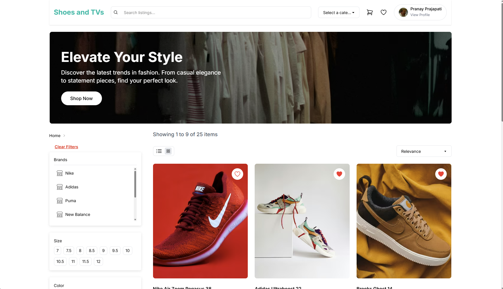

# B2B Marketplace Prototype

## Design Inspiration

This project's UI design is inspired by the Stella Ecommerce Website design on Dribbble: [Stella Ecommerce Website](https://dribbble.com/shots/25001090-Stella-Ecommerce-Website)



## Environment Setup

1. Create a `.env` file in the root directory with the following variables:
   ```env
   DATABASE_URL="mongodb://localhost:27017/b2b-marketplace"
   ```

## Installation

1. **Clone the repository**

   ```bash
   git clone <repository-url>
   cd coding-challenge
   ```

2. **Install dependencies**

   ```bash
   npm install
   ```

3. **Generate Prisma client**

   ```bash
   npx prisma generate
   ```

4. **Push the database schema**

   ```bash
   npx prisma db push
   ```

5. **Seed the database**

   ```bash
   npm run seed
   ```

6. **Start the development server**
   ```bash
   npm run dev
   ```

The application will be available at [http://localhost:3000](http://localhost:3000).

## Project Structure

```
coding-challenge/
├── app/                    # Next.js 13 app directory
│   ├── api/               # API routes
│   │   ├── categories/    # Category-related endpoints
│   │   └── search/        # Search and filter endpoints
│   └── page.tsx           # Main page component
├── components/            # Reusable UI components
│   ├── Header.tsx        # Navigation and search header
│   ├── ListingCard.tsx   # Product listing card
│   ├── FilterPanel.tsx   # Category filters
│   └── LoadingSpinner.tsx # Loading states
├── config/               # Type definitions and constants
├── lib/                  # Utility functions and configurations
├── prisma/              # Database schema and migrations
└── public/              # Static assets
```

## API Documentation

### Search Endpoint

`GET /api/search`

Query Parameters:

- `q` (optional): Search query
- `category` (optional): Category slug
- `offset` (optional): Pagination offset (default: 0)
- `limit` (optional): Results per page (default: 10)
- `filters` (optional): JSON string of attribute filters

Response:

```json
{
  "listings": [
    {
      "id": "string",
      "title": "string",
      "description": "string",
      "price": "number",
      "images": "string[]",
      "attributes": "object"
    }
  ],
  "pagination": {
    "total": "number",
    "limit": "number",
    "offset": "number"
  }
}
```

### Categories Endpoint

`GET /api/categories`

Returns all available categories with their attributes.

### Category Attributes Endpoint

`GET /api/categories/attributes?category=<slug>`

Returns attributes and possible values for a specific category.

## Data Models

### Category

- `id`: Unique identifier
- `name`: Category name
- `slug`: URL-friendly identifier
- `attributes`: Category-specific attributes

### Listing

- `id`: Unique identifier
- `title`: Product title
- `description`: Product description
- `price`: Product price
- `images`: Array of image URLs
- `categoryId`: Reference to category
- `attributes`: Dynamic attributes

### Database Management

- Use Prisma Studio to view/edit data:
  ```bash
  npx prisma studio
  ```
- Reset the database:
  ```bash
  npx prisma db push --force-reset
  ```
